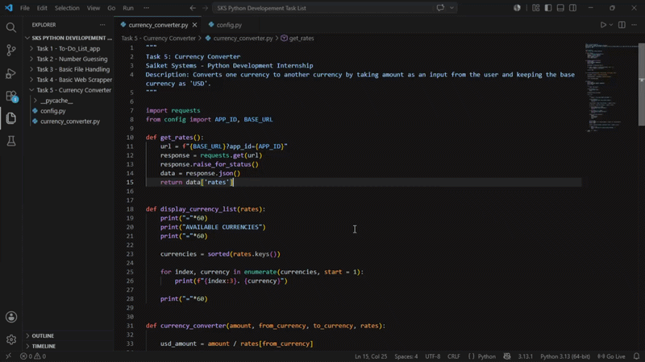
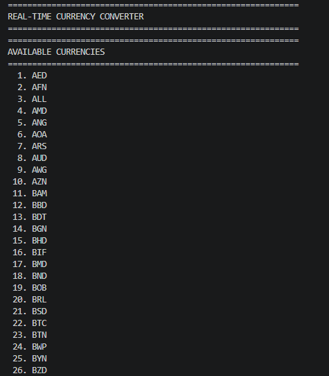
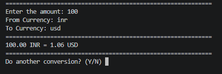

# Basic Currency Converter 💱

A Python currency converter that converts money between different currencies using real exchange rates.
Built as **Task 5** for **Saiket Systems Python Development Internship**.

---

## 📸 Project Preview

### Demo - Currency Converter in Action


### Available Currencies


### Currency Conversions


---

## ✨ Features

✅ Convert between multiple currencies
✅ Real-time exchange rates
✅ User-friendly interactive menu
✅ Display available currencies
✅ Handle invalid inputs gracefully
✅ Show conversion history
✅ Easy-to-use CLI interface

---

## 💻 How to Run

```bash
# Install dependencies (if needed)
pip install requests

# Run the converter
python currency_converter.py
```

---

## 📊 Example Usage

```
============================================================
CURRENCY CONVERTER
Saiket Systems - Python Development Internship
============================================================

MENU OPTIONS
1. Convert Currency
2. View Available Currencies
3. View Conversion History
4. Exit

Enter your choice: 1

Enter amount: 100
Enter from currency (USD): USD
Enter to currency (EUR): EUR

Result: 100 USD = 92.50 EUR
```

---

## 🔑 Technologies Used

- **Python 3.x**
- **Requests** - Fetch real exchange rates
- **APIs** - Real-time currency data

---

## 📚 What I Learned

✅ Working with APIs to fetch real data
✅ Parsing JSON responses
✅ Currency conversion calculations
✅ Storing and displaying conversion history
✅ Input validation and error handling
✅ Building interactive CLI applications

---

## 🎯 Key Concepts

| Feature | Description |
|---------|------------|
| **API Integration** | Fetch live exchange rates from APIs |
| **JSON Parsing** | Extract data from API responses |
| **Data Storage** | Track conversion history |
| **Error Handling** | Validate inputs and handle API failures |
| **User Input** | Interactive menu-driven interface |

---

## 💡 Supported Currencies

Common currencies supported:
- USD (US Dollar)
- EUR (Euro)
- GBP (British Pound)
- INR (Indian Rupee)
- JPY (Japanese Yen)
- AUD (Australian Dollar)
- CAD (Canadian Dollar)
- And many more...

---

## 📄 License

MIT License - See LICENSE file for details

---

## 👨‍💼 About

Built as **Task 5** of **Saiket Systems Python Development Internship**

**Skills Demonstrated:**
- API Integration
- JSON Parsing
- Real-time Data Processing
- Financial Calculations
- Error Handling
- Python Programming

---

## 🔗 Related Projects

- [Task 1: To-Do List Application](https://github.com/khushirai2216-boop/To-Do_List_app)
- [Task 2: Number Guessing Game](https://github.com/khushirai2216-boop/Number-Guessing-Game)
- [Task 3: File Handling Application](https://github.com/khushirai2216-boop/Basic-File-Handling)
- [Task 4: Web Scraper](https://github.com/khushirai2216-boop/Basic-Web-Scraper)

---